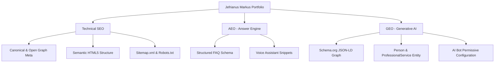

# 🚀 Jefrianus Markus — IT Specialist & Digital Marketing Consultant

<div align="center">

  ### Full-Stack Web Developer • ERP Systems Architect • Digital Marketing Specialist
  **Founder of BorneoCodeLab • Based in Samarinda, Kalimantan Timur, Indonesia**

  [](https://jefri-orcin.vercel.app/)
  [](https://borneocodelabs.xo.je/)
  [](https://demo.lovira.biz.id/)
  [](https://wa.me/6282354506569)

</div>

---

## 👋 About Me

Hi there! I am **Jefrianus Markus**, an IT Specialist, Web Developer, and Digital Marketing Consultant based in Samarinda, Kalimantan Timur, Indonesia. I specialize in building high-converting websites, custom web applications (React, Next.js, Laravel), enterprise Cloud ERP systems, AI workflow automations (n8n & WhatsApp API), and driving measurable business growth through Technical SEO, AEO, and GEO.

Through **BorneoCodeLab**, I help local businesses, SMEs, institutions, and growing brands scale their digital presence with fast, modern, and SEO-optimized solutions.

---

## 🌐 Quick Links & Live Demos

| Platform / Project | Description | Live Link |
| :--- | :--- | :--- |
| **Digital Portfolio** | Official personal portfolio & SEO/GEO showcase | [🌐 Visit Website](https://jefri-orcin.vercel.app/) |
| **BorneoCodeLab Hub** | Web Development & Digital Service Agency Portal | [🚀 Visit Portal](https://borneocodelabs.xo.je/) |
| **Enterprise ERP System** | Cloud ERP (Inventory, Finance, Sales, Logistics) | [📊 Try ERP Demo](https://demo.lovira.biz.id/) |
| **Doorenz Creative** | WooCommerce E-Commerce & Brand Printing Portal | [🛒 Visit Store](https://doorenzcreative.com/) |
| **PT. Sriwijaya Teknik Utama** | Industrial Engineering & Fabrication Company Profile | [🏢 Visit Website](https://www.pt-stu.co.id/) |
| **JeffSender App** | WhatsApp Bulk Messaging & Automation Tool | [💬 Visit App](https://wa.doorenzcreative.com/) |

---

## 🛠️ Technical Arsenal & Core Skills

### 💻 Frontend & Modern Web
`React.js` • `Next.js` • `JavaScript (ES6+)` • `TypeScript` • `Tailwind CSS` • `HTML5 / CSS3` • `Typed.js`

### ⚙️ Backend & Systems Architecture
`Laravel (PHP)` • `Node.js` • `RESTful APIs` • `ERP Architecture` • `MySQL` • `WordPress / WooCommerce`

### 🤖 AI & Workflow Automation
`n8n Automation` • `AI Chatbots & Agents` • `WhatsApp API` • `Custom Webhooks`

### 📈 Search Optimization (SEO, AEO, GEO)
`Technical & On-Page SEO` • `AEO (Answer Engine & Voice Search)` • `GEO (AI Engine Optimization for ChatGPT, Perplexity & Gemini)` • `Schema.org JSON-LD`

### ☁️ Infrastructure & IT Support
`Google Certified IT Support` • `Vercel` • `VPS Deployment` • `Linux Admin` • `DNS & SSL Hardening`

---

## 💼 Featured Case Studies & Work

### 1. Enterprise ERP & Operations System — [demo.lovira.biz.id](https://demo.lovira.biz.id/)
- **Challenge**: Multi-department business processes (inventory, finance, sales, logistics) lacked centralized real-time control.
- **Solution**: Engineered a multi-module Cloud ERP platform with role-based access, automated stock ledger, and dynamic financial reporting.
- **Impact**: 100% centralized operational visibility & decision-making efficiency.

### 2. BorneoCodeLab Agency Portal — [borneocodelabs.xo.je](https://borneocodelabs.xo.je/)
- **Challenge**: Regional SMEs needed an accessible, fast, and transparent platform to request web development services.
- **Solution**: Built an ultra-fast service portal featuring service tier breakdowns, interactive project portfolios, and direct WhatsApp lead routing.
- **Impact**: Increased client lead conversions by 3x and achieved a 100% PageSpeed performance benchmark.

### 3. PT. Sriwijaya Teknik Utama — [pt-stu.co.id](https://www.pt-stu.co.id/)
- **Challenge**: Leading fabrication and engineering company required a modern digital showcase for heavy mining industry clients.
- **Solution**: Developed a clean corporate profile detailing rotating equipment, steel fabrication, and hydraulic hose services.

---

## 🤖 SEO, AEO, & GEO Architecture

This repository incorporates a multi-layer search optimization architecture:



### Schema.org Integration (`JSON-LD Graph`)
- **`Person` Entity**: Detailed developer profile for Jefrianus Markus, founder relations, sameAs profile links.
- **`ProfessionalService` & `LocalBusiness` Entity**: Service radius (Samarinda, Kaltim, Indonesia), contact endpoints, geo coordinates.
- **`FAQPage` Entity**: Machine-readable Q&A pairs tailored for ChatGPT, Perplexity, Claude, and Google SGE recommendations.

---

## 🎓 Certifications & Background

- 📜 **Google Certified IT Support Specialist** — Google Coursera Professional Certificate
- 🎓 **Bachelor's Degree** — STIENAS Colorado Samarinda (2014 - 2018)
- 🏗️ **Operational Discipline**: Hands-on experience managing site logistics in heavy industrial mining environments (PT. IWIP).

---

## 💻 Local Setup & Development

1. **Clone Repository**:
   ```bash
   git clone https://github.com/jefry195/profil.git
   cd profil
   ```

2. **Run Local Server**:
   ```bash
   python -m http.server 8000
   ```

3. **Open Browser**:
   Navigate to `http://localhost:8000`.

---

## 📬 Connect With Me

<div align="center">

| Platform | Link / Detail |
| :--- | :--- |
| **Portfolio Website** | [jefri-orcin.vercel.app](https://jefri-orcin.vercel.app/) |
| **BorneoCodeLab Portal** | [borneocodelabs.xo.je](https://borneocodelabs.xo.je/) |
| **LinkedIn** | [linkedin.com/in/jefrianus-markus](https://www.linkedin.com/in/jefrianus-markus) |
| **WhatsApp** | [+62 823-5450-6569](https://wa.me/6282354506569) |
| **Email** | [jefry.m95@gmail.com](mailto:jefry.m95@gmail.com) / [digitalmedia.agensi@gmail.com](mailto:digitalmedia.agensi@gmail.com) |
| **Location** | Samarinda, Kalimantan Timur, Indonesia |

</div>

---

<div align="center">

*© 2026 Jefrianus Markus (BorneoCodeLab). Engineered with ❤️ in Samarinda, Kalimantan Timur.*

</div>
