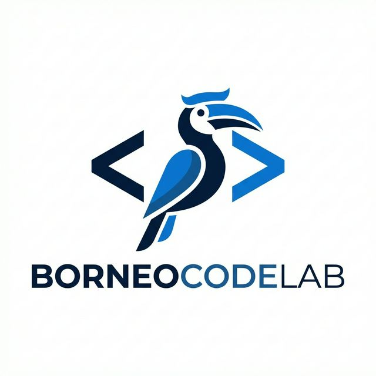
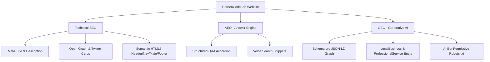

# 🚀 BorneoCodeLab  &mdash;  Jasa Pembuatan Website & Digital Solutions

<div align="center">

  

  ### Solusi Digital Terpercaya untuk Bisnis & UMKM Go Digital
  **Website Modern • Cepat • Responsive • Optimized for SEO, AEO, & GEO**

  [](https://borneocodelabs.xo.je/)
  [](https://wa.me/6282354506569)
  [](#-kontak--lokasi)
  [](#)

</div>

---

## 📌 Tentang BorneoCodeLab

**BorneoCodeLab** adalah penyedia layanan pembuatan website profesional dan solusi digital yang berbasis di **Samarinda, Kalimantan Timur**. Didirikan dan dikembangkan oleh **Jefrianus Markus**, BorneoCodeLab berfokus membantu bisnis lokal, UMKM, institusi pendidikan, dan perusahaan berkembang meningkatkan kredibilitas dan penjualan melalui platform digital modern.

Website ini dibangun menggunakan arsitektur modern yang ringan, ultra-cepat, serta dioptimasi penuh menggunakan standar terbaru:
- 🔍 **SEO (Search Engine Optimization)**: Peringkat tinggi di mesin pencari Google & Bing.
- 🎙️ **AEO (Answer Engine Optimization)**: Jawaban langsung ramah pencarian suara (Siri, Alexa, Google Assistant) & *Featured Snippets*.
- 🤖 **GEO (Generative Engine Optimization)**: Terstruktur rapi dengan Schema.org JSON-LD agar mudah dipahami & direkomendasikan oleh AI Engine seperti **ChatGPT**, **Perplexity**, **Claude**, dan **Gemini**.

---

## ⚡ Layanan Utama

| Layanan | Deskripsi |
| :--- | :--- |
| **🏢 Company Profile** | Website representatif untuk membangun citra profesional dan kredibilitas di mata klien & partner. |
| **🎓 Web Sekolah / E-Learning** | Platform akademik, pendaftaran online (PPDB), serta portal materi pembelajaran terpadu. |
| **🛒 Web UMKM / Toko Online** | Katalog produk interaktif, fitur keranjang belanja, integrasi ongkir otomatis, & payment gateway. |
| **📊 Sistem Informasi / ERP** | Sistem manajemen data terintegrasi (Stok Inventaris, Kasir, Keuangan, & Absensi). |
| **🚀 Landing Page** | Halaman promosi khusus dengan konversi tinggi untuk campaign iklan produk/jasa. |
| **⚙️ Custom Development** | Fitur & sistem dinamis kustom sesuai kebutuhan spesifik alur bisnis Anda. |

---

## 💼 Featured Portfolios

Berikut adalah proyek pilihan yang telah dikembangkan oleh BorneoCodeLab:

| Project | Kategori | Deskripsi | Tech Stack | Link Project |
| :--- | :--- | :--- | :--- | :--- |
| **PT. Sriwijaya Teknik Utama** | Company Profile | Perusahaan fabrikasi, perbaikan, & engineering terkemuka di Samarinda, Kaltim. | `WordPress` `WooCommerce` | [🌐 Visit Site](https://www.pt-stu.co.id/) |
| **Dooren'z Percetakan** | Toko Online | Portal percetakan & industri kreatif berpengalaman lebih dari 10 tahun. | `WordPress` `WooCommerce` | [🛒 Visit Store](https://doorenzcreative.com/) |
| **Digital Resume** | Landing Page | Website portfolio personal dan showcase keahlian web development & digital marketing. | `React` `Tailwind CSS` | [🚀 Visit Resume](https://jefri-orcin.vercel.app/) |
| **Cloud ERP System** | Sistem Informasi | System ERP terintegrasi untuk pengelolaan stok, keuangan, & SDM secara terpusat. | `PHP` `MySQL` `CSS` | [📊 Try Demo](https://demo.lovira.biz.id/) |
| **JeffSender** | Custom System | Platform otomasi pengiriman pesan massal & bot WhatsApp API. | `WhatsApp Automation` | [💬 Visit App](https://wa.doorenzcreative.com/) |
| **Digital Invitation** | Custom Web | Platform jasa pemesanan dan pembuatan undangan pernikahan digital. | `WordPress` `Custom Web` | [💌 Visit Site](https://lovira.biz.id/) |

---

## ⚙️ Fitur & Keunggulan Layanan

- 📱 **Mobile Responsive**: Tampilan sempurna di perangkat smartphone, tablet, maupun desktop.
- 🔐 **Secure & Fast**: Kode bersih, proteksi SSL, dan loading halaman cepat.
- 🎛️ **Halaman Admin User-Friendly**: Dashboard pengelolaan data intuitif yang mudah dioperasikan mandiri.
- 📊 **Integrasi Analytics & WhatsApp**: Tombol chat langsung WhatsApp & pelacakan statistik pengunjung.
- 🛠️ **Maintenance Support**: Garansi pemeliharaan dan panduan pengelolaan pasca-launch.

---

## 🤖 Optimasi SEO, AEO, & GEO Architecture

Repository ini menerapkan arsitektur SEO/GEO generasi terbaru:



### Schema.org Graph Integration (`JSON-LD`)
- **Organization & ProfessionalService**: Detail profil bisnis, lokasi koordinat Samarinda, area layanan Kaltim, jam buka, & kontak.
- **FAQPage Entity**: Format data Q&A mesin AI untuk pencarian langsung.
- **Person Entity**: Profil pengembang **Jefrianus Markus** terhubung ke jejaring profesional LinkedIn & Instagram.

---

## 💻 Panduan Jalankan Lokal (Local Setup)

1. **Clone Repository**:
   ```bash
   git clone https://github.com/jefry195/profil.git
   cd profil
   ```

2. **Jalankan Web Server Lokal**:
   Anda dapat menggunakan HTTP server sederhana (misalnya Python atau Live Server VS Code):
   ```bash
   # Menggunakan Python 3
   python -m http.server 8000
   ```

3. **Akses Website**:
   Buka browser dan akses [http://localhost:8000](http://localhost:8000).

---

## 📬 Kontak & Lokasi

<div align="center">

| Keterangan | Informasi |
| :--- | :--- |
| **Brand** | **BorneoCodeLab** |
| **Founder / Lead Dev** | **Jefrianus Markus** (IT Specialist & Digital Marketing Consultant) |
| **Alamat** | Jl. AW. Syahranie Gg. 15 RT. 23 Kel. Air Hitam, Kota Samarinda, Kalimantan Timur |
| **WhatsApp** | [+62 823-5450-6569](https://wa.me/6282354506569) |
| **Email** | [digitalmedia.agensi@gmail.com](mailto:digitalmedia.agensi@gmail.com) |
| **Social Media** | [](https://www.facebook.com/jefry195) [](https://www.instagram.com/jefry195) [](https://www.linkedin.com/in/jefrianus-markus) |

</div>

---

<div align="center">

*© 2026 BorneoCodeLab. Developed with ❤️ by **Jefrianus Markus**.*

</div>
